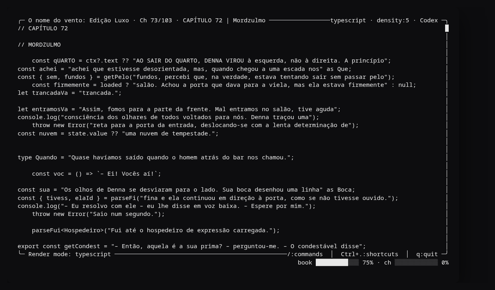
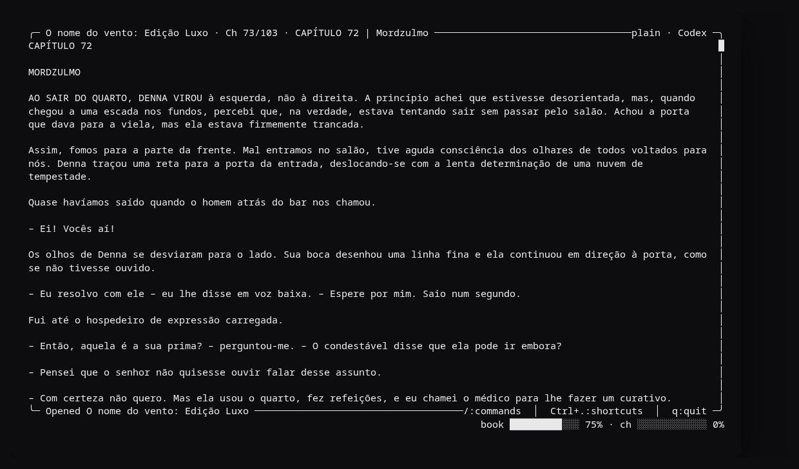
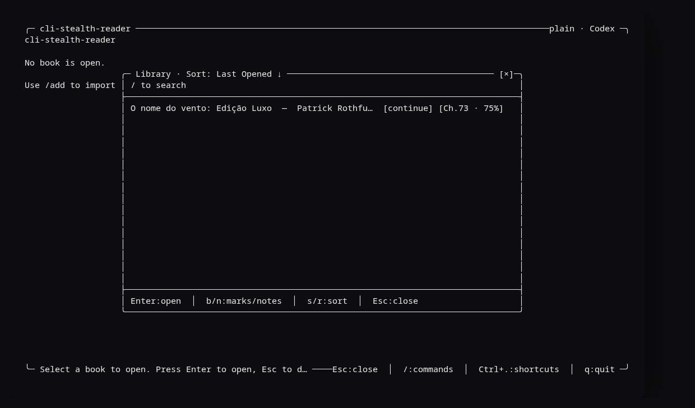
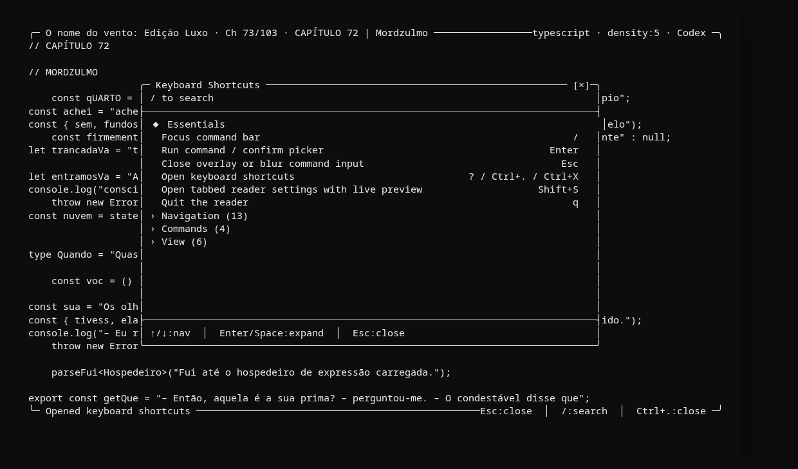
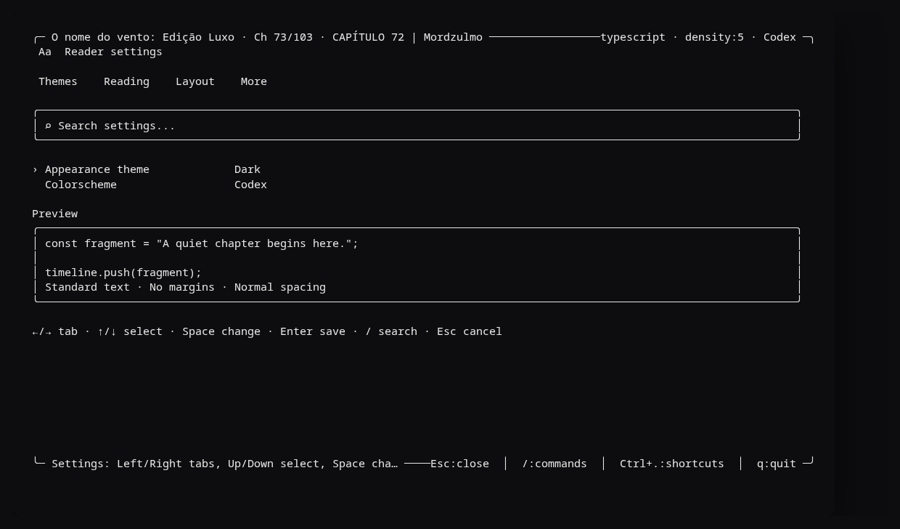

# cli-stealth-reader

[Node.js](https://nodejs.org/)

A full-screen EPUB reader for the terminal, with rich rendering and one distinctive twist: **stealth** mode disguises the text as plausible code (TypeScript, Python, or Rust), so it looks like you're programming while you read.



## Screenshots

| Plain mode | Library |
|---|---|
|  |  |

| Keyboard shortcuts | Settings |
|---|---|
|  |  |

## Overview

**cli-stealth-reader** offers several reading experiences:

- **TypeScript mode (stealth)**: The text is rendered as realistic TypeScript — 12 contextual patterns (const, let, arrow functions, export, await, nullish coalescing, type annotations, and so on) with variable names generated from the words of the text itself
- **Python mode (stealth)**: Disguises the text as Python code
- **Rust mode (stealth)**: Disguises the text as Rust code
- **Plain mode**: Clean, readable prose with clear visual formatting

On top of that:

- A modern TUI with an integrated status bar
- 5 colorschemes and 6 appearance themes (dark, light, colorblind-friendly, and ANSI)
- 25+ slash commands with support for arguments, aliases, and flags
- A persisted SQLite library using XDG directories via `better-sqlite3`
- Strict EPUB import with EPUB3 support, NCX fallback, and anchor fragments
- CBZ (comics) and PDF support in addition to EPUB
- Auto-detection of `.epub`, `.cbz`, and `.pdf` files in the current directory
- Reading position synced per book
- An interactive file picker for the current directory
- Mouse scrolling and a progress sidebar
- A clickable shortcut bar and a searchable modal via `Ctrl+.`
- Focus mode: a centered single-block view for immersive reading
- Search with highlighting and result cycling
- Bookmarks with a navigation overlay
- Tags and notes per reading position
- State export/import (positions, bookmarks, notes, tags) for syncing across machines
- Library sorting by title, author, progress, or last opened
- Dialogue highlighting in plain mode
- Stealth code density control (1–5)

## Installation

### Requirements

- **Node.js 20+**
- A terminal with 24-bit color support

### Quick Setup

```bash
git clone https://github.com/felipebueno/cli-stealth-reader.git
cd cli-stealth-reader
npm install
npm run dev
```

To build the CLI:

```bash
npm run build
node dist/index.js
```

To install the command globally in your environment (via a local link):

```bash
npm run build
npm link
which stealth-reader
```

After that, you can run `stealth-reader` from any directory.

## Quick Start

1. Start the reader: `npm run dev`
2. Import a book with `/add`, or press `Enter` to open the recursive EPUB/CBZ/PDF picker for the configured library
3. Use `j`/`k`, the arrow keys, `Space`/`b`, or the mouse wheel to navigate
4. Press `m` to cycle through the rendering modes (plain, typescript, python, rust)
5. Press `f` to enable focus mode (centered single-block reading)
6. Press `/` to open the command bar
7. Press `Ctrl+.` (`Ctrl+X` on terminals that don't support the shortcut) to see every shortcut

### Example: Switching Modes

```
/mode plain        # Enables simple reading mode
/mode typescript   # Enables TypeScript stealth mode (default)
/mode python       # Enables Python stealth mode
/mode rust         # Enables Rust stealth mode
```

Or use `m` to cycle through the modes without opening the command bar.

### Example: Changing Colorscheme and Theme

```
/colorscheme codex      # Monochrome with OpenAI blue
/colorscheme claude     # Claude Code's coral and lavender
/colorscheme graphite   # Neutral theme
/colorscheme amber      # Warm theme
/colorscheme forest     # Green theme

/theme dark             # Current dark theme
/theme light            # Light theme with a chalk background
/theme dark-colorblind  # Colorblind-friendly dark theme
/theme light-colorblind # Colorblind-friendly light theme
/theme dark-ansi        # Dark theme with ANSI colors
/theme light-ansi       # Light theme with ANSI colors
```

## Rendering Modes

### Stealth Modes (TypeScript, Python, Rust)

The `m` key cycles through the modes: **plain → typescript → python → rust → plain**

The text is masked as real code in each language. In TypeScript mode, 12 contextual patterns are used, with variable and function names generated from the book's own words:

```typescript
const aliceBeginning = "Alice was beginning to get very tired of sitting";
// by her sister on the bank, and of having nothing to do.
const peeped = () => "Once or twice she had peeped into the book";
export const pictures = "her sister was reading, but it had no pictures";
const conversations: string = "or conversations in it, 'and what is the use of a book',";
// thought Alice, 'without pictures or conversations?'
throw new Error("The day was very hot and made her feel sleepy.");
console.log("Alice began to feel very sleepy and stupid.");
```

Occasional structural blocks (imports, interfaces, async functions) are inserted to simulate a real file. **Code density** is adjustable from 1 to 5 (the `d` key or `/density`): density 1 favors comments, density 5 is pure code.

**The benefit**: nobody will notice you're reading. It looks like legitimate work.

### Plain Mode

A clear, readable interface with visual formatting:

```
CHAPTER 1 — DOWN THE RABBIT-HOLE

Alice was beginning to get very tired of sitting by her sister on the
bank, and of having nothing to do. Once or twice she had peeped into the
book her sister was reading, but it had no pictures or conversations in
it, 'and what is the use of a book', thought Alice, 'without pictures or
conversations?'

▏ The day was very hot and made her feel sleepy. Alice began to feel
▏ very sleepy and stupid.

· · · · · · ·

▏ Suddenly a White Rabbit with pink eyes ran close by her.
```

- Uppercase headings in an accent color
- Quotes prefixed with `▏`
- List items with `·`
- Scene breaks as `· · · · · · ·`

## Keyboard Shortcuts

### Navigation


| Key       | Action                                  |
| --------- | --------------------------------------- |
| `j` / `↑` | Scroll up                               |
| `k` / `↓` | Scroll down                             |
| `Space`   | Page forward                            |
| `b`       | Page back                               |
| `Home`    | Go to the start of the chapter          |
| `End`     | Go to the end of the chapter            |
| `←` / `→` | Previous chapter / next chapter         |
| `T`       | Open the table of contents              |
| `B`       | Open the bookmarks overlay              |
| `[` / `]` | Go back / forward in navigation history |
| `wheel`   | Scroll with the mouse                   |
| `g`       | Go to the top of the current reading    |
| `G`       | Go to the end of the current reading    |


### Commands


| Key       | Action                                                    |
| --------- | --------------------------------------------------------- |
| `/`       | Open the command bar                                      |
| `Enter`   | Run the active command                                    |
| `Esc`     | Close an overlay or clear the input                       |
| `Tab`     | Move through the selection / complete the command         |
| `n` / `N` | Next / previous search result (after `/search`)           |
| `d`       | Delete the selected bookmark (inside the bookmark overlay) |


### Interface


| Key   | Action                                                          |
| ----- | ---------------------------------------------------------------- |
| `m`   | Cycle the rendering mode (plain → typescript → python → rust)    |
| `f`   | Toggle focus mode (centered single block)                        |
| `d`   | Cycle the stealth code density (1 → 3 → 5)                       |
| `c`   | Open the colorscheme picker                                      |
| `C`   | Open the theme picker                                            |
| `S`   | Open tabbed settings with a live preview                         |
| `p`   | Cycle progress (chapter/book time remaining → % → hidden)         |
| `Ctrl+.` | Show keyboard shortcuts (`Ctrl+X` is the compatible fallback) |
| `q`   | Quit the reader                                                  |


### In the Library (`/book`)


| Key   | Action                                                                |
| ----- | --------------------------------------------------------------------- |
| `s`   | Cycle the sort criterion (last opened → title → author → progress)    |
| `r`   | Reverse the sort direction                                            |


## Slash Commands

Press `/` to open the command bar. Every command supports arguments and flags.

### Navigation

```bash
/prev [count]          # Go to the previous chapter (or back N chapters)
/next [count]          # Go to the next chapter (or forward N chapters)
/chapters [query]      # Open the table of contents
  --current            # Highlight the current chapter
  --flat               # Show a flat structure (no hierarchy)

/goto <position>       # Jump to a position in the book
  10%                  # By global percentage
  --chapter 3          # By chapter number

/search [term]         # Search the book's text
  --global / -g        # Global search (all chapters)
```

Use `n` / `N` after `/search` to cycle through the results.

Use `[` / `]` to move through the history (back/forward).

### Bookmarks

```bash
/mark [label]          # Create a bookmark at the current position
/marks                 # Open the bookmarks overlay
/delmark <id-or-label> # Remove a bookmark by ID or label
```

The `B` key opens the bookmarks overlay. Inside it, `Enter` navigates to the bookmark and `d` removes it.

### Books

```bash
/changebook [query]    # Switch to another book
  --recent             # List only recently read books
  --cwd                # Search only the current folder
  --sort               # Open the picker with sorting

/resume [book-query]   # Resume a specific book
  --latest             # Resume the last one read

/add [path]            # Import an EPUB, CBZ, or PDF; or open the picker
  --cwd                # Look for files in the current folder
  --force              # Re-import even if it already exists

/librarydir [path]     # Show/set the library root (`--cwd` restores the CWD)

/remove [book-query]   # Remove a book from the library
  --current            # Remove the current book

/removecurrent         # Remove only the book being read
```

### Tags and Notes

```bash
/tag [tag]             # Add a tag to the current book; with no argument, lists the tags
  -d <tag>             # Remove a tag

/tags                  # List the current book's tags (alias for /tag)

/note <text>           # Add a note at the current position
  -l                   # Open the notes overlay
  -d <id>              # Delete a note by ID
```

Tags appear in the library next to the progress. Filter by tag using `/changebook <tag>`.

### Export / Import

```bash
/export [path]         # Export positions, bookmarks, notes, and tags to JSON
/import [path]         # Import reading state from a JSON file
```

The exported file is indexed by `importHash` — no path dependency, which makes it ideal for syncing your reading across machines.

### Toggl Track

```bash
/toggl auth                         # Open the API token page
/toggl auth <token>                 # Connect and sync the account
/toggl sync                         # Refresh projects, descriptions, and the active timer
/toggl recent                       # See recent projects and descriptions
/toggl start "Book" --project "Reading books"
/toggl stop
/toggl log "Book" --duration 45m --project "Reading books"
/toggl --disconnect
```

Durations accept formats like `25m`, `1.5h`, and `900s`. The token is stored in the local settings database; command history always replaces credentials with `<redacted>`.

### View

```bash
/mode <mode>           # Change the rendering mode
  plain | typescript | python | rust

/density [level]       # Control the stealth code density (1–5)
  1 = more comments, 5 = pure code

/colorscheme [scheme]  # Change the colorscheme
  --list               # List the available colorschemes
  --preview            # Flag accepted for compatibility

/theme [theme]         # Change the appearance theme
  dark | light | dark-colorblind | light-colorblind | dark-ansi | light-ansi
  --list               # List the available themes

/highlight             # Enable dialogue highlighting in plain mode
  --on                 # Enable
  --off                # Disable

/toggleprogress [mode] # Progress: time-chapter|time-book|book|both|chapter|hidden
  time-chapter | time-book | book | both | chapter | hidden

/settings              # Open the searchable reader settings panel
                       # ←/→ changes tab, ↑/↓ selects, Space toggles
                       # Enter saves, / searches within the tab, Esc cancels
```

### System

```bash
/help [command]        # See help for a specific command
  --all                # List every command

/keyboardshortcuts     # See the keyboard shortcuts
  --category <type>    # Filter by: navigation, commands, view
```

### Aliases

- `/book` → `/changebook`
- `/keys` → `/keyboardshortcuts`
- `/config` → `/settings`
- `/tags` → `/tag`

### Focus Mode

Press `f` to enter focus mode: the screen shows a single centered block of content, free of distractions. Use `j`/`k` or the arrow keys to move forward and back block by block. When you leave focus mode, the equivalent position is preserved in normal scrolling.

## Color Themes

Five themes designed for extended reading:

### Codex (Default)

Black, white, and gray with the Codex CLI brand blue.

### Claude Code

Coral, lavender, and green over dark neutrals, following Claude Code's visual hierarchy.

### Graphite

Minimalist neutral gray — classic and professional. Maximum discretion.

### Amber

Warm gold and orange tones — comfortable at night. Reduces eye strain.

### Forest

Soft natural green — a calm environment. Ideal for long reading sessions.

## Architecture

```
src/
  index.ts           # CLI entry point
  tui.ts             # Main TUI loop and app state
  types.ts           # Shared types (CanonicalBook, CanonicalBlock, etc.)
  commands.ts        # Slash command definitions and parser
  executor.ts        # Slash command execution
  renderers.ts       # Rendering dispatcher (plain vs. code)
  focus.ts           # Focus mode logic (centered single block)
  themes.ts          # Predefined colorschemes and appearance themes
  help.ts            # Keyboard shortcut definitions
  color.ts           # ANSI formatting utilities
  storage.ts         # SQLite abstraction with WAL (XDG dirs)
  paths.ts           # XDG path resolution
  discovery.ts       # Recursive EPUB/CBZ/PDF discovery in the configured library
  screen.ts          # Terminal screen management
  input.ts           # Keyboard input management

  renderers/
    typescript.ts    # TypeScript renderer (12 contextual patterns)
    python.ts        # Python renderer
    rust.ts          # Rust renderer
    shared.ts        # Utilities shared across renderers

  parser/
    epub.ts          # EPUB import pipeline (JSZip + validation)
    cbz.ts           # CBZ parser (comics in ZIP)
    pdf.ts           # PDF parser
    html.ts          # Block extraction from HTML (parse5)
    xml.ts           # XML parsing utilities
    index.ts         # Parser dispatcher by file type
```

### Data Flow

```
EPUB file → epub.ts (JSZip + parsing) → CanonicalBook (chapters → blocks)
                                                  ↓
                                       storage.ts (SQLite)
                                                  ↓
                          tui.ts (AppState) ← → commands.ts
                                  ↓
                          renderers.ts → ANSI output → Terminal
```

### Storage

State is persisted in standard XDG directories:

- `**$XDG_DATA_HOME/cli-stealth-reader/**`: SQLite database (WAL mode)
  - Tables: `books`, `chapters`, `positions`, `diagnostics`, `settings`, `command_history`, `bookmarks`, `book_tags`, `notes`
- `**$XDG_CACHE_HOME/cli-stealth-reader/**`: JSON cache of books

EPUBs, CBZs, and PDFs found recursively in the configured library are offered on the start screen and in `/add`. Use `/librarydir ~/Books` to persist a different root, or `/add --cwd` to search the current directory temporarily.

## Development

### Scripts

```bash
npm run dev            # Run with tsx (no build needed)
npm run build          # Compile TypeScript → dist/
npm start              # Run dist/index.js (the built CLI)
npm test               # Run all tests
```

### Running a Single Test

```bash
node --import tsx --test test/epub.test.ts
node --import tsx --test test/commands.test.ts
```

### Core Data Model

`**CanonicalBlock**` — the basic unit of content:

```typescript
type CanonicalBlock = 
  | { type: "heading"; text: string }
  | { type: "paragraph"; text: string }
  | { type: "blockquote"; text: string }
  | { type: "list-item"; text: string }
  | { type: "scene-break" }
  | { type: "image"; text?: string }
  | { type: "anchor"; id: string }
```

`**CanonicalChapter**` — a chapter with metadata:

```typescript
{
  title: string
  href: string
  blocks: CanonicalBlock[]
  wordCount: number
}
```

`**CanonicalBook**` — a complete book:

```typescript
{
  title: string
  author?: string
  chapters: CanonicalChapter[]
  language?: string
  diagnostics: ImportDiagnostic[]
}
```

### EPUB Import Pipeline

1. Validate the file: mimetype, `META-INF/container.xml`
2. Parse the OPF manifest and spine
3. Extract the TOC: EPUB3 `nav.xhtml` → NCX fallback → spine fallback
4. For each TOC item: parse the HTML, extract blocks, resolve anchor fragments
5. Normalize to the canonical format, compute word counts, collect diagnostics

## Implementation Notes

- App state and every rendered string go through `tui.ts` — the "source of truth"
- Commands support aliases (for example, `/book` is an alias for `/changebook`)
- Quoted arguments are interpreted literally (for example, `/add "My Book.epub"`)
- Customizable progress: time remaining (from a learned reading pace) or `%` bars (`time-chapter`, `time-book`, `book`, `both`, `chapter`, `hidden`)
- Removing a book only deletes the library entry — the original file is not deleted
- Reading position is persisted per book automatically
- Stealth modes (TypeScript, Python, Rust) are persisted via `settings`; the `m` key cycles through them
- Stealth code density (1–5) is persisted via `settings`; the `d` key cycles 1→3→5
- The settings panel uses `Themes`, `Reading`, `Layout`, and `More` tabs, with a transactional preview
- `Text size`, `Page margins`, and `Line spacing` adjust the reading column without depending on the terminal emulator
- Focus mode preserves the equivalent position when you return to normal scrolling
- Export/import uses `importHash` as the key, with no dependency on the file's path on the system
- Tags are case-insensitive in the database (LOWER); notes are indexed by `book_id`
- Navigation history (back/forward) is kept in memory only (not persisted)

## Contributing

Contributions are welcome. Follow the existing code style and run the tests before opening a PR.
